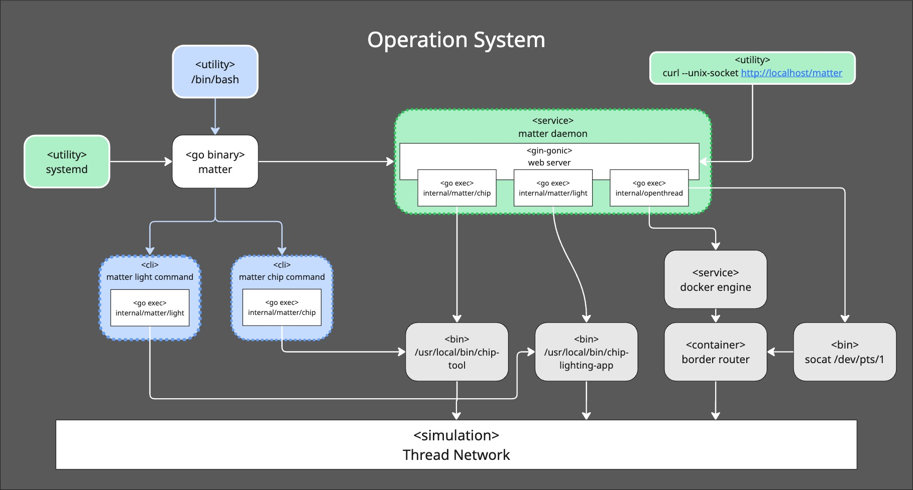
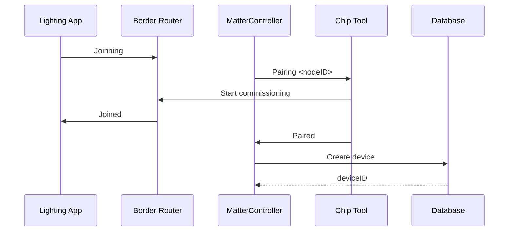
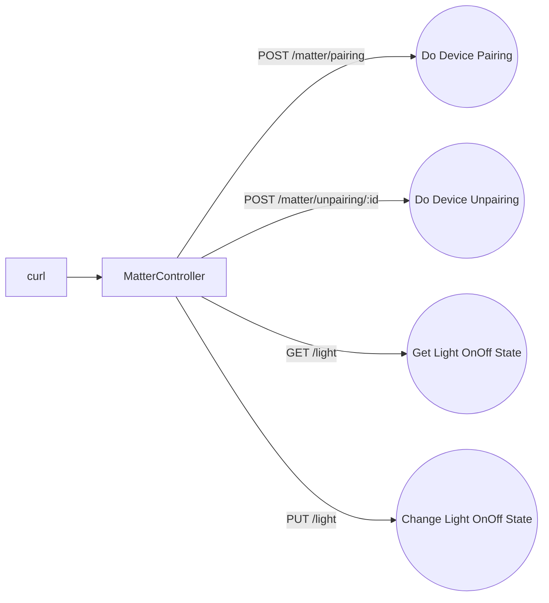
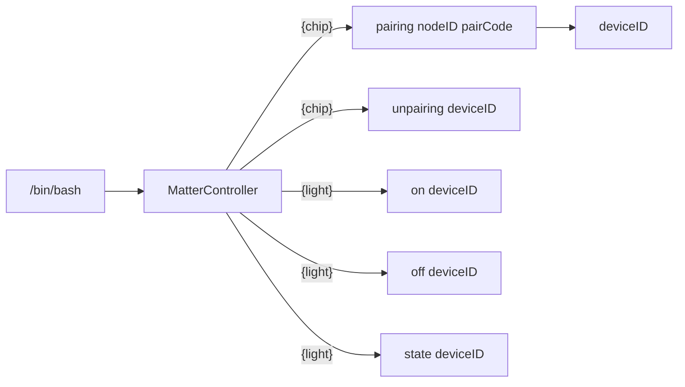

# Architecture Overview

# **Overview**

這份文件描述了 **Matter Controller** 的系統架構設計，包括各個元件之間的關係以及互動方式。

# **Architecture**

當以 **Service** 形式部署時，Matter Controller 扮演整個系統的 **核心協調元件**，負責統籌各模組的運作，並對外提供 **RESTful API**，使外部客戶端或 Web 工具能夠進行 **控制與監控**。

同時，系統也提供 **命令列介面（CLI）模式**，允許使用者直接在主機端進行操作。此模式除了操作更為直覺外，還能輸出更完整的 **日誌資訊**，有助於 **偵錯與問題追蹤**，特別適合於開發與維運階段使用。

# Detailed Design

### Flow Diagram

- Matter Controller 啟動流程

---

- Matter Controller REST API Flow

---

- Matter Controller CLI Flow

## Trade-offs

| 選項 | 優點 | 缺點 | 決策理由 |
| --- | --- | --- | --- |
| **使用容器部署 OTBR** | - 開箱即用，官方映像檔已包含依賴- 快速啟動原型，不必處理繁瑣編譯 | - 部署體積較大- 效能略低於原生- 較難與宿主系統緊密整合 | 選擇容器化，因為我們在意的是**快速原型**，不是最小體積 |
| **透過 ot-ctl 控制 OTBR** | - CLI 工具直接呼叫，學習成本低- 方便手動測試與 demo- 不需再學習 D-Bus API | - 缺乏程式化 API，不利於自動化- 無法與其他服務統一透過 D-Bus 整合 | 為了**快速原型**，選擇 `ot-ctl`，後續若需要程式化整合再考慮 D-Bus |
| 使用 systemd service | - 內建監控與日誌，與系統整合性高 | - 僅適用 Linux若需支援 Windows/macOS，需額外設計其他啟動方式 | 產品主要針對 Linux 部署，使用 systemd 可大幅減少維運成本 |
| 支援 REST API | - 可以依照 JSON Schema / OpenAPI 自動產生 input validation，並相容 curl / 瀏覽器，易於測試與除錯 | - 需要維護Schema contract | 適合快速原型，能快速檢查輸入合法性並對應 Database 